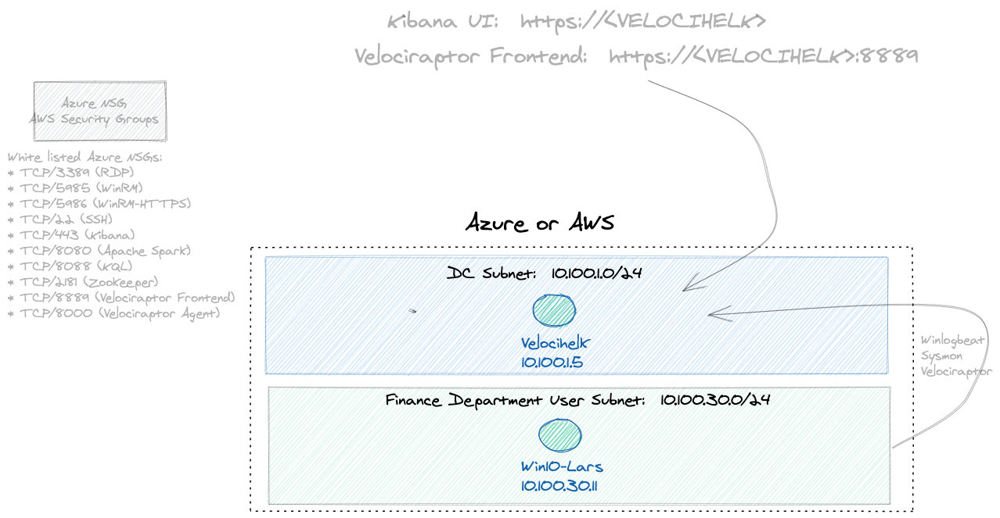

# Overview
Cyber Range deployment of HELK and Velociraptor!  Automated terraform deployment of one system running HELK + Velociraptor server with one registered Windows endpoint in Azure or AWS.  A collection of Terraform and Ansible scripts that automatically (and quickly) deploys a small HELK + Velociraptor R&D lab.

# Use Cases
* EDR Testing lab 
* Penetration Testing lab
* SIEM / Threat Hunting / DFIR / Live Response lab with HELK + Velociraptor [1, 2]
* Data Science research with HELK server, Jupyter notebooks
* Detection Engineering research with Mordor [3, 4]

# Documentation
Please see the full documentation for details and getting started with installation.

[Full Documentation Site](https://blue.iknowjason.io) 
