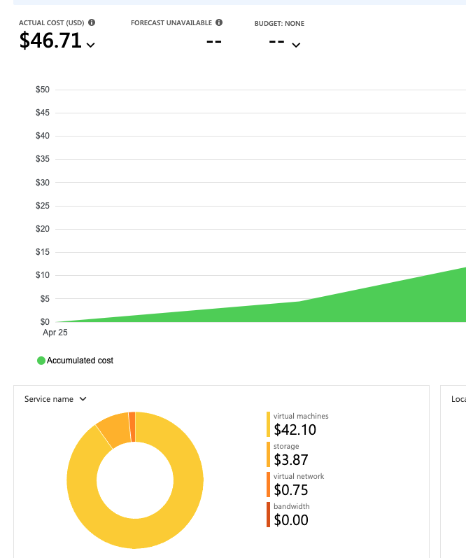
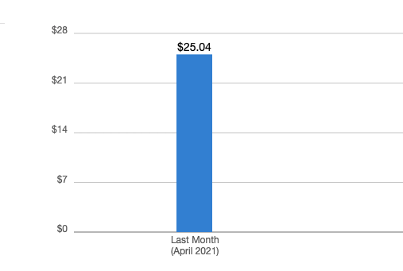

# Cost Analysis

## Important Information
As this tool spins up cloud resources, it will result in charges to your Azure or AWS account.  Efforts have been made to minimize the costs incurred, but the tool author is not responsible for any charges or security issues that may result from usage of this tool.  Be sure to tear down all resources when not using them.

## Azure Cost Analysis
Use the Cost Analysis feature of Azure to measure the daily cost of the enabled 
resources.  Here are some approximate figures with standing up a new subscription
and resource group and then running BlueCloud.  The approximate cost is $46.71 after 
running the lab for 5 days.  Day 5 was the last day of the billing month, which might 
explain the small increase from day 4 to day 5.

### Table:  Azure Accrued Costs
| Days Running  |  Costs Accrued |
|---------------|----------------|
|    1 day      |     $4.94      |
|    2 days     |     $17.52     |
|    3 days     |     $27.39     |
|    4 days     |     $35.93     |
|    5 days     |     $46.71     |

### Screen Shot from Azure Subscription 
Here is a screen shot showing costs accrued from a new installation on my subscription 
after 5 days.

 

## AWS Cost Analysis
Below are some samples on a new installation of running BlueCloud on AWS.  The billing feature took a few days to render accrued costs, so it starts at day 4.  Day 5 is the last day of billing month.

### Table:  Accrued AWS Costs
| Days Running  |  Costs Accrued |
|---------------|----------------|
|    4 days     |     $21.01     |
|    5 days     |     $25.04     |
|    6 days     |                |
|    7 days     |                |

### Screen Shot from AWS Billing 
Here is a screen shot showing costs accrued from a new installation on my subscription 
after 5 days.

